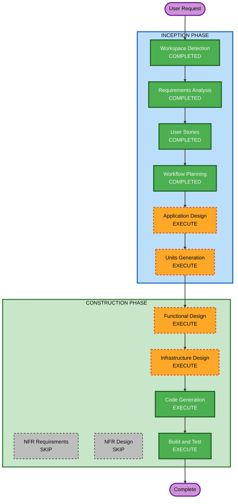

# Execution Plan

## Detailed Analysis Summary

### Change Impact Assessment
- **User-facing changes**: Yes — 대시보드 UI (비교 테이블 + 트렌드 차트)
- **Structural changes**: Yes — 신규 시스템 전체 아키텍처 설계 필요
- **Data model changes**: Yes — 크롤링 데이터 스키마, S3 파티셔닝 구조
- **API changes**: No — 외부 API 제공 없음 (대시보드만 제공)
- **NFR impact**: Low — 내부 5명 이하 사용, 성능/보안 요구 낮음

### Risk Assessment
- **Risk Level**: Medium
- **Rollback Complexity**: Easy (Greenfield, 기존 시스템 영향 없음)
- **Testing Complexity**: Moderate (외부 사이트 의존 크롤링 테스트)

## Workflow Visualization



### Text Alternative
```
Phase 1: INCEPTION
- Workspace Detection (COMPLETED)
- Requirements Analysis (COMPLETED)
- User Stories (COMPLETED)
- Workflow Planning (COMPLETED)
- Application Design (EXECUTE)
- Units Generation (EXECUTE)

Phase 2: CONSTRUCTION
- Functional Design (EXECUTE)
- NFR Requirements (SKIP)
- NFR Design (SKIP)
- Infrastructure Design (EXECUTE)
- Code Generation (EXECUTE)
- Build and Test (EXECUTE)
```

## Phases to Execute

### INCEPTION PHASE
- [x] Workspace Detection (COMPLETED)
- [x] Requirements Analysis (COMPLETED)
- [x] User Stories (COMPLETED)
- [x] Workflow Planning (COMPLETED)
- [ ] Application Design - EXECUTE
  - **Rationale**: 신규 시스템으로 컴포넌트 식별, 서비스 레이어 설계, 컴포넌트 간 의존성 정의 필요
- [ ] Units Generation - EXECUTE
  - **Rationale**: 크롤러(3사), 데이터 파이프라인, 대시보드 등 복수 모듈로 분해 필요

### CONSTRUCTION PHASE
- [ ] Functional Design - EXECUTE
  - **Rationale**: 크롤링 데이터 모델, 전처리 비즈니스 로직, S3 스키마 설계 필요
- [ ] NFR Requirements - SKIP
  - **Rationale**: 내부 5명 이하 사용, 보안 확장 비활성, 성능 요구 낮음. 별도 NFR 분석 불필요
- [ ] NFR Design - SKIP
  - **Rationale**: NFR Requirements 스킵에 따라 자동 스킵
- [ ] Infrastructure Design - EXECUTE
  - **Rationale**: Lambda, EventBridge, S3, Athena 등 AWS 인프라 매핑 필요
- [ ] Code Generation - EXECUTE (ALWAYS)
  - **Rationale**: 실제 코드 구현 필수
- [ ] Build and Test - EXECUTE (ALWAYS)
  - **Rationale**: 빌드 및 테스트 지침 생성 필수

### OPERATIONS PHASE
- [ ] Operations - PLACEHOLDER

## Success Criteria
- **Primary Goal**: 3사 USIM 요금제 프로모션 자동 크롤링 및 비교 대시보드 구축
- **Key Deliverables**:
  - 3사 크롤러 Lambda 함수 (Python)
  - EventBridge 스케줄 설정
  - S3 데이터 적재 파이프라인
  - Streamlit 대시보드 (비교 테이블 + 트렌드 차트)
- **Quality Gates**:
  - 3사 URL에서 데이터 정상 추출 확인
  - 크롤링 실패 시 빈 데이터 미적재 확인
  - 대시보드 인증 없이 접속 가능 확인
